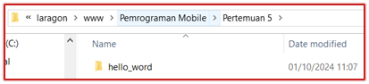
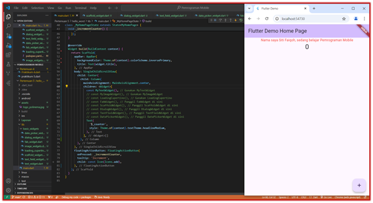
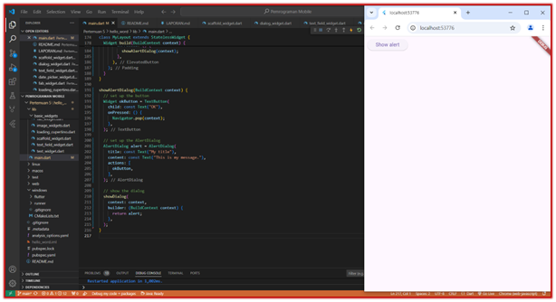
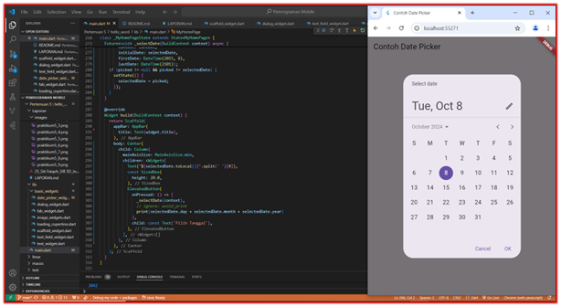

# Flutter Pemrograman Mobile - Jobsheet 5
**Nama:** Siti Faiqoh  
**NIM:** 2241760026  
**Kelas:** SIB 3D  

## Daftar Praktikum:

### 1. Praktikum 1: Membuat Project Flutter Baru
- Membuat project Flutter dengan nama `hello_world`.
- Tampilan awal project berhasil dibuat dengan pesan "Your Flutter Project is ready!".
- Nama project harus huruf kecil tanpa spasi.

**Screenshot:**

---

### 2. Praktikum 2: Menghubungkan Perangkat Android/Emulator
- Menjalankan aplikasi Flutter pada emulator atau perangkat fisik (Android/iOS).
- Saya menggunakan **Flutter Chrome** sebagai platform menjalankan aplikasi.

---

### 3. Praktikum 3: Membuat Repository GitHub
- Membuat repository di GitHub dengan nama `flutter-fundamental-part1`.
- Menginisialisasi project Git di `VS Code`.
- Melakukan commit dan push file ke repository GitHub, termasuk file `README.md` dan project.

**Screenshot:**

---

### 4. Praktikum 4: Menerapkan Widget Dasar
- **Langkah 1: Text Widget**
    - Membuat file `text_widget.dart` dan menampilkan teks `"Nama saya Siti Faiqoh, sedang belajar Pemrograman Mobile"`.
    - Melakukan import dan penyesuaian di `main.dart`.

    **Screenshot:**

    

- **Langkah 2: Image Widget**
    - Membuat file `image_widget.dart` untuk menampilkan gambar `logo_polinema.jpg`.
    - Menambahkan path gambar pada `pubspec.yaml`.

    **Screenshot:**

    

---

### 5. Praktikum 5: Menerapkan Widget Material Design dan iOS Cupertino
- **Langkah 1: Cupertino Button dan Loading Bar**
    - Membuat file `loading_cupertino.dart` untuk menampilkan tombol Cupertino dan `CupertinoActivityIndicator`.

    **Screenshot:**

    

- **Langkah 2: Floating Action Button (FAB)**
    - Membuat file `fab_widget.dart` untuk menampilkan `FloatingActionButton` dengan ikon `thumb_up`.

    **Screenshot:**

    

- **Langkah 3: Scaffold Widget**
    - Mengatur tata letak menggunakan widget `Scaffold` dan menambahkan floating action button serta bottom navigation bar.

    **Screenshot:**

    

- **Langkah 4: Dialog Widget**
    - Membuat dialog menggunakan `AlertDialog` dengan tombol `OK` untuk menutup dialog.

    **Screenshot:**

    
    

- **Langkah 5: Input dan Selection Widget (TextField)**
    - Menambahkan `TextField` untuk menerima input dari pengguna.

    **Screenshot:**

    
    

- **Langkah 6: Date and Time Pickers**
    - Menambahkan widget `DatePicker` untuk memilih tanggal dan waktu.

    **Screenshot:**

    
    

---

## Screenshot Hasil
(Semua screenshot dari tiap langkah)

## Repository GitHub
Link repository: [(https://github.com/faiqoh04/Pemrograman-Mobile/tree/main/Pertemuan%205/hello_word)]
